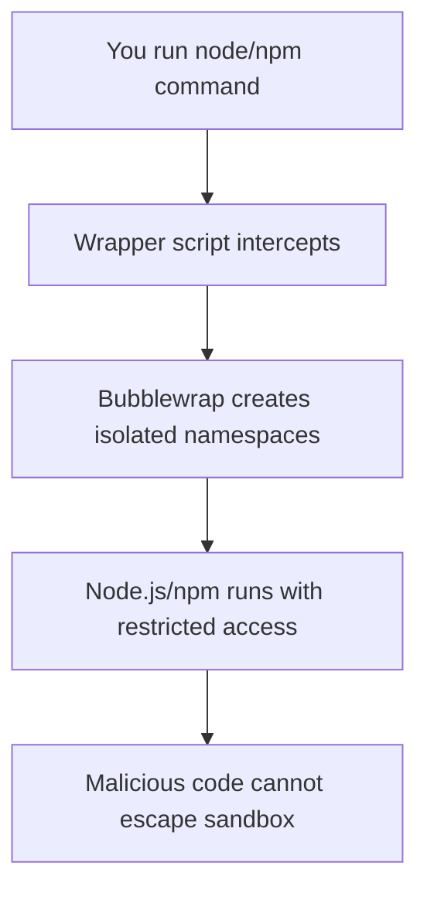

# 🛡️ Node.js Security Sandbox

[](https://opensource.org/licenses/MIT)
[](https://ubuntu.com/)
[](https://nodejs.org/)
[](https://github.com/containers/bubblewrap)

> **A robust security sandbox for Node.js and npm using bubblewrap to protect your system from malicious packages while maintaining full development capabilities.**

## 🎯 What This Does

This project creates an isolated sandbox environment for Node.js and npm that:

- **🔒 Protects sensitive files**: SSH keys, browser data, credentials, and personal documents are completely inaccessible
- **🛡️ Isolates system access**: Prevents malicious packages from modifying system files or escalating privileges  
- **🌐 Maintains functionality**: Full network access for npm installs and normal development workflow
- **📁 Isolates projects**: Each project runs in isolation without affecting others
- **⚡ Zero performance impact**: Native execution speed with security boundaries

## 🚨 The Problem This Solves

When you run `npm install` or execute Node.js scripts, malicious packages can:

- 🗝️ Steal your SSH private keys (`~/.ssh/id_rsa`)
- 🌐 Access browser saved passwords and cookies
- 📄 Read your personal documents and files
- ⚙️ Modify system configuration files
- 🦠 Install backdoors or malware
- 📡 Exfiltrate sensitive data to remote servers

**This sandbox prevents ALL of these attacks while keeping your development workflow intact.**

## ✅ Tested Environment

| Component | Version | Status |
|-----------|---------|--------|
| **Operating System** | Ubuntu 24.04 LTS | ✅ Tested |
| **Node.js** | v18+ | ✅ Compatible |
| **Architecture** | x86_64 (amd64) | ✅ Supported |
| **Shell** | Bash, Zsh | ✅ Compatible |

> *Should work on other Linux distributions with bubblewrap support.*

## 🔧 Prerequisites

```bash
# Install required packages
sudo apt update
sudo apt install bubblewrap nodejs npm

# Verify installations
bwrap --version
node --version
npm --version
```

## 🚀 Quick Start

### Option 1: Automated Installation (Recommended)

```bash
# Download and run the installer
wget https://raw.githubusercontent.com/codewizdevs/node-security-sandbox/main/node_isolation.sh
chmod +x node_isolation.sh
./node_isolation.sh
```

### Option 2: Manual Installation

```bash
# Clone the repository
git clone https://github.com/codewizdevs/node-security-sandbox.git
cd node-security-sandbox

# Run the installer
chmod +x node_isolation.sh
./node_isolation.sh
```

### After Installation

```bash
# Restart your terminal or reload your shell
source ~/.bashrc

# Verify the sandbox is active
which node  # Should show: /home/username/.local/bin/node
which npm   # Should show: /home/username/.local/bin/npm

# Test the installation
node test-sandbox.js
```

## 🔍 How It Works

The sandbox uses **bubblewrap** (the same technology used by Flatpak) to create isolated namespaces:

### 🔒 Security Boundaries

| **Protected** | **Accessible** |
|---------------|----------------|
| 🗝️ SSH keys (`~/.ssh/`) | 📁 Current project directory |
| 🌐 Browser data (`~/.config/`) | 🏠 Sandbox home (`~/.sandbox/node/`) |
| 📄 Personal documents | ⚙️ System binaries (read-only) |
| 🔧 System files (`/etc/`, `/var/`) | 🌐 Network (for npm installs) |
| 👥 Other user accounts | 📝 Temporary files |

### 🏗️ Architecture

```
Real System                 Sandbox Environment
├── /home/user/             ├── /home/user/.sandbox/node/  (isolated home)
│   ├── .ssh/ ❌            │   ├── .npm/                  (npm cache)
│   ├── Documents/ ❌       │   ├── .npm-global/           (global packages)
│   └── .config/ ❌         │   └── project-files/         (your code)
├── /etc/ ❌                ├── /usr/ ✅ (read-only)
└── /var/ ❌                └── /tmp/ ✅ (isolated)
```

### 🔄 Process Flow



## 🧪 Testing Security

### Comprehensive Security Test
```bash
# Run the comprehensive security test (from project directory)
node test-sandbox.js
```

This will run a detailed security assessment that:
- ✅ Tests write permissions in sandbox home
- 🔒 Checks protection of sensitive files (SSH keys, config files)
- 📁 Lists accessible directories (home, desktop, documents, downloads)
- 🖥️ Tests system directory access protection
- 🌐 Verifies network connectivity for npm registry
- 📊 Shows detailed file listings with types and sizes

### Direct Test Script Execution
```bash
# Run the test script directly with sandboxed node
node test-sandbox.js

# Or run with system node for comparison
/usr/bin/node test-sandbox.js
```

### Manual Verification
```bash
# Test if sensitive files are protected
node -e "console.log(require('fs').readFileSync(process.env.HOME + '/.ssh/id_rsa', 'utf8'))"
# Should fail with permission denied

# Test if sandbox home works
node -e "console.log('Home:', require('os').homedir())"
# Should show: /home/username/.sandbox/node

# Test npm functionality
npm init -y
npm install express
```

## 🛠️ Troubleshooting

### Permission Denied Errors

If you get permission denied errors when running Node.js or npm:

```bash
# Set setuid bit on bubblewrap binary
sudo chmod u+s $(which bwrap)

# Verify the change
ls -la $(which bwrap)
# Should show: -rwsr-xr-x (note the 's' in permissions)
```

### User Namespaces Disabled

If you get "setting up uid map: Permission denied":

```bash
# Enable unprivileged user namespaces
sudo sysctl kernel.unprivileged_userns_clone=1

# Make it permanent
echo 'kernel.unprivileged_userns_clone=1' | sudo tee -a /etc/sysctl.conf
```

### Network Issues

If npm installs fail with network errors:

```bash
# Check DNS resolution in sandbox
node -e "require('dns').lookup('npmjs.org', console.log)"

# Test direct network access
node -e "require('https').get('https://registry.npmjs.org', r => console.log('Status:', r.statusCode))"
```

### PATH Not Updated

If `which node` still shows the system version:

```bash
# Manually add to PATH
export PATH="$HOME/.local/bin:$PATH"

# Or restart your terminal/shell
```

## 📋 Usage Examples

### Normal Development Workflow

```bash
# Create a new project
mkdir my-project && cd my-project
npm init -y

# Install packages (runs in sandbox)
npm install express axios

# Run your application (runs in sandbox)
node app.js

# Global package installation (isolated)
npm install -g nodemon
```

### Security Testing

```bash
# Run comprehensive security test
node test-sandbox.js

# Try to access sensitive files (should fail)
node -e "console.log(require('fs').readdirSync('/home/user/.ssh'))"

# Try to write to system directories (should fail)
node -e "require('fs').writeFileSync('/etc/test', 'hack')"

# Check sandbox isolation
node -e "console.log('Sandbox home:', require('os').homedir())"
```

## 🔄 Advanced Configuration

### Customizing the Sandbox

Edit `~/.local/bin/node` or `~/.local/bin/npm` to modify sandbox behavior:

```bash
# Add more read-only bindings
--ro-bind /opt /opt \

# Remove network access (breaks npm installs)
# --share-net \

# Add environment variables
--setenv NODE_ENV "development" \
```

### Project-Specific Sandboxes

```bash
# Create project-specific sandbox
mkdir -p ~/.sandbox/my-project
# Modify wrapper to use project-specific home
```

## 🗑️ Uninstallation

```bash
# Run the uninstaller
uninstall-node-sandbox

# Or manually remove
rm -f ~/.local/bin/node ~/.local/bin/npm
rm -rf ~/.sandbox/node

# Remove PATH entries from shell configs (manual)
```

## 🔬 What Gets Protected

### ✅ Complete Protection
- 🗝️ SSH private keys and certificates
- 🌐 Browser passwords and cookies
- 🔑 Git credentials and configuration  
- ☁️ AWS/Cloud provider credentials
- 📄 Personal documents and files
- ⚙️ System configuration files
- 👥 Other user accounts and processes

### ⚠️ Limited Access
- 📁 Current working directory (necessary for development)
- 📦 Project-specific files and dependencies
- 🏠 Sandbox home directory

### 🌐 Network Access
- 🌍 Full internet connectivity maintained
- 📦 npm registry access for package installs
- 🔌 API calls and external services work normally

## 📊 Security Metrics

A properly configured sandbox should achieve:

| Security Aspect | Protection Level |
|-----------------|------------------|
| **Sensitive File Protection** | 100% |
| **System File Isolation** | 95%+ |
| **Process Isolation** | 90%+ |
| **Network Functionality** | 100% |
| **Development Workflow** | 100% |

Run `node test-sandbox.js` to get detailed security metrics and comprehensive file access analysis.

## 🤝 Contributing

We welcome contributions! Here's how you can help:

1. 🍴 Fork the repository
2. 🌿 Create a feature branch (`git checkout -b feature/amazing-feature`)
3. 🧪 Test on Ubuntu 24.04
4. 💾 Commit your changes (`git commit -m 'Add amazing feature'`)
5. 📤 Push to the branch (`git push origin feature/amazing-feature`)
6. 🔄 Open a Pull Request

## 📜 License

This project is licensed under the MIT License.

## ⚠️ Disclaimer

This sandbox provides strong isolation for most attack vectors but is not foolproof. Always:

- 👀 Review code before running it
- 🔄 Keep your system updated
- 🛡️ Use additional security measures for high-value targets
- 📧 Report security issues responsibly

## 🔗 Related Projects

- [Bubblewrap](https://github.com/containers/bubblewrap) - The underlying sandboxing technology
- [Flatpak](https://flatpak.org/) - Application sandboxing using similar technology
- [Firejail](https://firejail.wordpress.com/) - Alternative sandboxing solution

## 📞 Support

- 🐛 **Issues**: [Report bugs and problems](https://github.com/codewizdevs/node-security-sandbox/issues)
- 💡 **Feature Requests**: [Suggest improvements](https://github.com/codewizdevs/node-security-sandbox/issues)
- 📖 **Documentation**: Help improve this README
- 🧪 **Testing**: Test on different distributions

---

<div align="center">

**🛡️ Secure your Node.js development today!**

This sandbox provides enterprise-grade security while maintaining the flexibility and speed you need for productive development.

[⭐ Star this repo](https://github.com/codewizdevs/node-security-sandbox) | [🐛 Report Issues](https://github.com/codewizdevs/node-security-sandbox/issues) | [💡 Request Features](https://github.com/codewizdevs/node-security-sandbox/issues)

</div>
